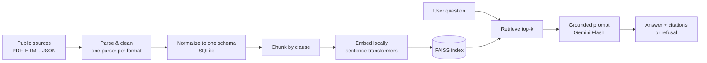

# ClauseFinder

Ask plain questions about UK building regulations and get a short answer with the exact clause it came from, or an honest "I could not find that in my sources."
 
ClauseFinder is a small Retrieval-Augmented Generation (RAG) tool. It downloads public building regulations, splits them by clause, finds the passages most relevant to a question, and asks a language model to answer **only** from those passages, always with citations. If the answer is not in the retrieved text, it says so instead of guessing.
 
> Built as a take-home challenge for the AI & Data Engineer role at SECO.

Demo Video Link: https://drive.google.com/file/d/1U5A7EXyXemBcP092t_Apd5W3QW8NcPyB/view?usp=sharing
 
---

## The six questions
 
### 1. What problem are you solving, and for whom?
 
For building inspectors and design reviewers. They spend a lot of time digging through long regulation PDFs to find the one clause that applies, and then checking they read the current version. ClauseFinder lets them ask a normal question, like "what is the minimum width of a firefighting stair?", and get a short answer with the exact clause it came from. When the answer is not in its sources, it refuses clearly. The goal is to save lookup time without asking anyone to trust an answer they cannot check.
 
### 2. Why is this relevant to SECO?
 
SECO inspects buildings and checks that what gets built is safe and compliant, and the brief points out that a lot of that technical knowledge sits in documents that are hard to search. This is a small, concrete example of turning regulation text into something an inspector can actually query, with citations, which fits how compliance work is done: you always point to the rule. The same approach would extend naturally to SECO's own internal standards and inspection reports.
 
### 3. Which data sources did you use, and why?
 
Three public sources, in three different formats, all under the UK Open Government Licence v3.0 (so they can legally be redistributed in a public repo):
 
- **PDF:** the Approved Documents for Part B (fire safety), Part K (protection from falling and collision) and Part M (access to buildings).
- **HTML:** the Building Regulations 2010 text from legislation.gov.uk.
- **JSON:** a structured catalogue of the Approved Documents from GOV.UK.
I chose UK regulations on purpose. They are free, openly licensed, neatly structured by clause number (which is perfect for citations) and in English. I deliberately avoided the Eurocodes and EN standards, even though they are closer to SECO's world, because they are copyrighted and cannot be shared in a public project. Using three formats also let me show that the pipeline handles messy, mixed inputs.
 
### 4. What technical decisions did you make, and what trade-offs did you accept?
 
- **Chunk by clause, not by fixed size.** Each chunk is roughly one section, so every answer can cite a real clause number. Trade-off: a bit more parsing work than a naive splitter.
- **Local embeddings, hosted answer.** Embeddings run on my laptop with sentence-transformers (free and private). Only the final answer uses a hosted model, Gemini Flash on the free tier, so no GPU is needed. Trade-off: the free tier has tight rate limits, which capped my evaluation run (see below).
- **Let the model refuse, do not hard-cut on a score.** Similarity scores are brittle, so instead of dropping results below a threshold I prompt the model to say when the passages do not answer the question. I still show a low-confidence hint when the top score is weak.
- **SQLite plus FAISS on disk, no cloud database.** Simple, reproducible, and easy for a grader to run end to end.

### 5. What would you put in production tomorrow vs. what would you throw away?
 
**Keep:** the whole pipeline shape. Download with provenance, clean, normalize to one schema, chunk by clause, embed, index in FAISS, retrieve, and answer with citations and honest refusal. That part is solid.
 
**Throw away or redo:**
- the free-tier Gemini key, since the rate limits make it unusable at any real scale (I would move to a paid or self-hosted model);
- the substring-based faithfulness check in my evaluation, which is fine for catching obvious misses but not good enough for production (I would use an LLM-as-judge over a larger set);
- plain single-shot retrieval, where I would add a re-ranker and probably hybrid keyword plus vector search.
### 6. If you had 3 more months, what would the product look like?
 
The big one: ingest SECO's own inspection reports and defect observations and link them to the clauses they relate to, so an inspector sees the defect, the rule, and similar past cases together. That is the real pain point in the brief. On top of that: a wider and multilingual corpus (Eurocodes and Belgian or EU standards if licensing allows, using a multilingual embedding model), better retrieval (hybrid search plus re-ranking), a proper evaluation suite that runs on every change, and handling of regulation versions over time so you can ask "what applied in 2019?". A React front end and user accounts would come once it is more than a demo.
 
---
 
## How it works


 
A single command, `scripts/build_all.py`, runs the left side of the diagram (download to index). The Streamlit app runs the right side (question to answer).
 
## Tech stack
 
- **Language:** Python 3.11
- **Dependencies:** uv
- **Embeddings:** sentence-transformers (`BAAI/bge-small-en-v1.5`), run locally
- **Vector store:** FAISS (on disk)
- **Metadata store:** SQLite
- **Generation:** Google Gemini 2.5 Flash via the `google-genai` SDK
- **UI:** Streamlit
- **Parsing:** PyMuPDF (PDF), BeautifulSoup (HTML), pandas (JSON)
## Setup and run
 
You need Python 3.11, [uv](https://docs.astral.sh/uv/), and a free [Google Gemini API key](https://aistudio.google.com/apikey).
 
```bash
# 1. Clone
git clone https://github.com/PraveenAgnihotry/clausefinder.git
cd clausefinder
 
# 2. Install (creates the env and installs the package in editable mode)
uv sync
 
# 3. Set your API key
cp .env.example .env
# then open .env and paste your key into GEMINI_API_KEY
 
# 4. Build the data (download, clean, normalize, chunk, embed, index)
uv run python scripts/build_all.py
 
# 5. Run the app
uv run streamlit run app/streamlit_app.py
```
 
The first build downloads the embedding model into a local `./models` folder (git-ignored), so it does not touch your system cache. After that, everything runs offline except the final answer call.
 
To run the evaluation:
 
```bash
uv run python eval/run_eval.py
```
 
## Evaluation
 
I hand-wrote a 25-case test set: 19 in-corpus questions across Parts B, K and M, plus 6 out-of-corpus questions that should be refused. Two cases are documented known failures, where the model gets it wrong and `eval/eval_set.jsonl` explains why (one parse artifact, one false refusal). Retrieval and answer quality are scored separately, because they fail for different reasons.
 
One honest caveat: the Gemini free tier allows limited requests per day, so a single run of the harness may not be able to cover all 25 cases. The numbers below are from the cases that completed in one run. The rate limit, not the method, is the current ceiling on test coverage.
 
|                       Metric                      | Result (completed cases)  |
|                        ---                        |            ---            |
| Retrieval hit-rate, correct document in top-k     | 100% (6/6)                |
| Retrieval hit-rate, correct clause in top-k       | 100% (3/3)                |
| Refusal accuracy on out-of-corpus questions       | 100% (1/1)                |
| Answer faithfulness on verified cases             | 100% (2/2)                |
| Known failures that behaved as documented         | yes                       |
 
What this shows: when a clause is in the corpus, retrieval reliably surfaces it, and the model either answers from it or honestly refuses. Faithfulness here is a substring check (does the answer contain the expected figure), which is a deliberate v1 limitation, not a real judge.
 
## Limitations
 
- Not legal or professional advice. Always confirm against the cited original document.
- Covers only Parts B, K and M and the Building Regulations 2010, for England.
- The answer is only as good as the retrieved passages. Tables and figures inside the PDFs chunk poorly and are the main source of errors.
- Free-tier rate limits make it unsuitable for heavy or production use as configured.

## Data and licence
 
The regulation sources are Crown copyright, used under the [Open Government Licence v3.0](https://www.nationalarchives.gov.uk/doc/open-government-licence/version/3/). Source URLs, fetch dates and licence are recorded in `data/manifest.json`. The project code is released under the MIT Licence.